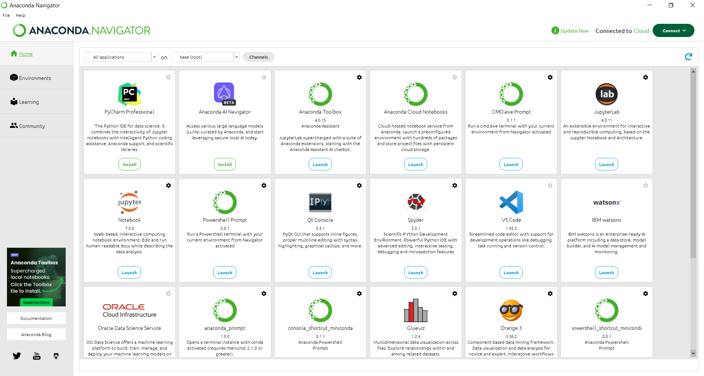
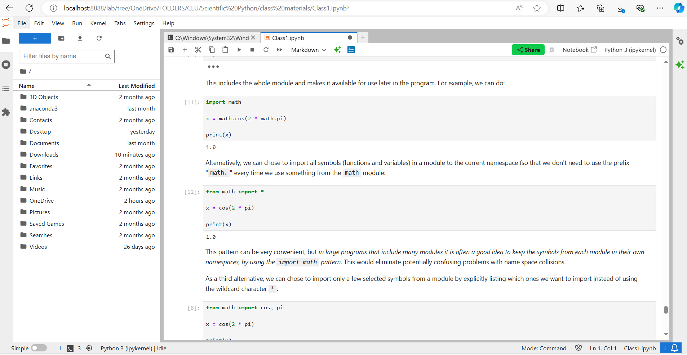

# How to setup your Python environment for Data Science & Analysis

In the next few sections we are taking the reader through the steps of setting up an environment for data science. But what is a data science enviroment?

A data science environment is essentially a setup that includes the **tools, software, and hardware** needed to perform data science tasks. Here's a simple way to explain it:

1. **Tools and Software**: This includes programming languages like Python or R, and specialized software like Jupyter Notebooks, which allow data scientists to write and execute code. It also involves libraries and packages data manipulation, visualization, and machine learning.

2. **Data Handling**: Data scientists work with large datasets, so the environment includes databases and data storage solutions where data is collected, stored, and retrieved. This can be anything from local files to cloud storage solutions.

3. **Processing and Analysis**: The environment provides the computational power needed to process and analyze data. This might involve local machines or cloud-based services that offer scalable computing resources.

4. **Collaboration and Version Control**: Tools like Git and platforms like GitHub are used for version control and collaboration, allowing multiple data scientists to work on the same project without overwriting each other's work.

5. **Model Development and Deployment**: The environment supports the development, training, and deployment of machine learning models.

In summary, a data science environment is a comprehensive setup that enables data scientists to efficiently collect, process, analyze, and visualize data, as well as develop and deploy models. It combines various tools and technologies to streamline the workflow and make data-driven decision-making possible.

The below is far from comprehensive, but it is sufficient to follow Data Analysis coding course on MSBA at Central European University. Beyond making students able to follow the course we are aiming to introduce such a technology stack that datas professional usualy need in their jobs to carry out local development tasks (that is develop solutions on their own PCs or laptops). We are also trying to explain what these components are for and how they fit into the data science development workflow. 


## 1. Install Anaconda

`Anaconda` is a popular open-source distribution of the Python and R programming languages, specifically designed for data science and machine learning tasks. For our purpose we can consider Anaconda as an ecosystem of the Python programming language and the tools built around it to make data-focused Python development easier. 

Go to https://www.anaconda.com/download and provide email to download distribution.You will get the dwonload link vie email. 

Click the installer and go through the [istallation process](https://docs.anaconda.com/anaconda/install/windows/). 

Once you have installed Anaconda open `Anaconda Navigator`. Here you will see a number of applications, some of them already installed, some to be installed optionally, for your data science workflow. 



There are two components that we are going to use extensively:

1. `Anaconda Prompt` is a command line interface (see below) with which we can interact with our basic Python environment.
2. `Jupyter lab` is a web-based interactive development environment for *notebooks*, code, and data. `Jupyter notebooks` allow you to create and share computational documents with code, text and output. These notebooks are going to be our primary tool to carry out analytical exercises. 


## 2. Download Notepad++

It is a lightweight text editor which supports multiple file formats and programming languages with the appropriate formatting. (No code completion though.)

VS Code (see below) and other integrated development environments (IDEs) offer a more comprehensive service than Notepad++ but sometimes it is easier to do some quick-and-dirty text editing here. 


## 3. Get Windows Terminal

`Windows Terminal` is a [command line interface](https://en.wikipedia.org/wiki/Command-line_interface) (`CLI`) application from Microsoft. Compared to Graphical User Interfaces (GUIs) these 'black windows' offer wider options to the experienced user to interact with applications, services, and system resources. CLIs may look overwhelming at the beginning but a little practice makes these interfaces more familiar. In many cases, running a command is much faster than opening a graphical user interface (GUI), then finding and clicking the appropriate drop-down menu to carry out a task. Commands that you can run on these interfaces usually offer a wider range of customization options than GUIs.  

Windows Terminal is a modern host application for many programs that act as command-line interpreters. These programs are called `shells`. The primary component windows are Command Prompt and PowerShell but, as we will see it below, other command-line applications can easily be integrated to Windows Terminal. The easiest way to get it is from Microsoft Store; you can also go to https://learn.microsoft.com/en-us/windows/terminal/install for the package and the installation instructions.   

Anaconda also offers a command line interface called `Anaconda Prompt`. We will use Anaconda Prompt during DA coding courses so you may want to add Anaconda Prompt to your Windows Terminal. To do so, follow the instructions here: https://arturomoncadatorres.com/incorporating-anaconda-prompt-windows-terminal/. This setup will make you a little more familiar with the neat tools a data scientist, or any computer professional, has at his or her disposal. 

For a clarification of the exact differences between a terminal, a console, a shell, and a command-line interface see [this article](https://www.freecodecamp.org/news/command-line-for-beginners/). As you make progress in your data career you will start preferring CLIs to GUIs. 


### 3a. Optional: Get Windows Subsystem for Linux

This is a Linux OS running on your Windows computer which enables you to develop cross-platform applications, improve your data science or web development workflows and 
manage IT infrastructure without leaving Windows.

When you need to deploy your DS or DA solution to a production environment you won't be able to avoid working with Linux. WSL offers Widows users a great way to get familiar with Linux without leaving their Windows operating system. 

`Windows Subsystem for Linux`, or WSL, comes in two forms: the original WSL1 and the second-generation WSL2. WSL2 uses virtualization technology to run a `Linux kernel` on your Windows operating system. 

The best way to install WSL is described [here](https://learn.microsoft.com/en-us/windows/wsl/install). For those who are interested in the opportunities using WSL we highly recommend [these turorials](https://learn.microsoft.com/en-us/windows/wsl/setup/environment). We are going to use WSL later in the program to develop containerized applications using [Docker](https://learn.microsoft.com/en-us/windows/wsl/tutorials/wsl-containers). 


## 4. Install git for Windows and Register to GitHub

`git` is a so-called '*version controll system*' for developing, managing, and sharing your code. The main point here is [*version control*](https://git-scm.com/book/en/v2/Getting-Started-About-Version-Control): changes in code can be traced and earlier code versions can be reinstalled if recent development steps result in faulty program behavior. 

Git is also used for collaboration, when multiple teams develop various functions of the same application. We are not going to use this feature during the course but getting familiar with concept is a must for every developer. 

Git runs locally on your PC but you can synchronize your local development with a web-based service where you can publicly share your code with others. We are using [GitHub](https://github.com/) for this purpose.  

**Installing git**: Go to https://git-scm.com/download/win and install it from here.   

**Important!**: during the installation process select the `Use Visual Studio Code as Git's default editor` option when prompted for the default editor. Leave all other options as recommended by the installer. 

Once you have installed git go to https://github.com/ and register and account. [GitHub](https://en.wikipedia.org/wiki/GitHub) is a developer platform that allows developers to create, store, manage and share their code. It has a wide range of services for companies and IT professionals. (You can even write and publish your [online books](https://www.gitbook.com/) with a related service.) GitHub is a payed service for those interested in its full capabilities but it is freely available for hosting, sharing and version-controlling our simple computer codes. 

After registration open Windows Terminal (or Windows Powershell directly) and enter the following two commands using your username and and email address:
```bash
git config --global user.name "yourusername"
git config --global user.email youremail@example.com
```

This will make sure that you can interact with your GitHub account from your terminal of from an IDE such as VS Code. 


## 5. Get VS Code

VS Code is one of the most widely used IDEs (integrated development environment) used in programming. It is a lightweight but powerful source code editor which runs on your desktop and is available for Windows, macOS and Linux. It comes with built-in support for JavaScript, TypeScript and Node.js and has a rich ecosystem of extensions for other languages and runtimes (such as C++, C#, Java, Python, PHP, Go, .NET).


The easiest way to to get it is from the Microsoft Store. Alternatively, you can download it from https://code.visualstudio.com/download.   

Once you have VS Code you need the following extensions (all can be installed from the IDE):

- Python    
Id: ms-python.python   
VS Marketplace Link: https://marketplace.visualstudio.com/items?itemName=ms-python.python)

- Jupyter   
ms-toolsai.jupyter,  
Name: Jupyter   
Id: ms-toolsai.jupyter     
Description: Jupyter notebook support, interactive programming and computing that supports Intellisense, debugging and more.  
Version: 2024.6.0  
Publisher: Microsoft  
VS Marketplace Link: <https://marketplace.visualstudio.com/items?itemName=ms-toolsai.jupyter>
- markdownlint   
DavidAnson.vscode-markdownlint  
Name: markdownlint   
Id: DavidAnson.vscode-markdownlint   
Description: Markdown linting and style checking for Visual Studio Code   
Version: 0.55.0   
Publisher: David Anson   
VS Marketplace Link: https://marketplace.visualstudio.com/items?itemName=DavidAnson.vscode-markdownlint

There is basically nothing in coding and development that you cannot do using VS Code. Imagine VS Code as a frame to which we add extensions as functional blocks to carry out specific tasks. You can use VS Code for years without being able to discover all the functions it offers. We recommend go through [some tricks and tips](https://code.visualstudio.com/docs/getstarted/tips-and-tricks) just get the basics. 

## 6. Create a virtual environment for your data science course

A virtual environment is an isolated workspace for a particular project. In effect it is a directory structure which contains Python executable files and other files which tell Python the packages and their version numbers to use in that project. We set up this environment to make sure that we all get exactly the same results when running the code snippets. If you want ot take a deep dive into Python's virtual environment read [this](https://realpython.com/python-virtual-environments-a-primer/) detailed discussion of the topic. 

We are using `conda` to manage our environments and `pip` to download Python packages and to manage the dependencies between them. 

We also want to make sure that we are using a stable version of Python where all packages run fine. Users downloading Python to their laptops may have different versions, some of the working slightly differently than others. We can specify a certain Python version for each environment we use in various projects. For our project we are using Python 3.10. The following steps take you through the environment creation process. 

Type `Anadonda prompt` in the program search bar and open the application. This is a command line inteface, or CLI, with which you can interact with your Anaconda environment. This is the main environment where your Python code will run. 

Create a dedicated *virtual environment* by typing   

```bash
conda create --name myenv python=3.10
```
where '*myenv*' is the name of your dedicated virtual environment. You can call it *py310* to indicate the Python version you are using or *dataanalysis* to remind you on what you are using the virtual environment for, or whatever name you prefer. 

To activate your virtual environment open an Anaconda Prompt windows (either from the Windows menu or by opening an Anaconda Promt windows from Windows Terminal) and type 
```bash
conda activate myenv
```
where '*myenv*' is the name of your dedicated virtual environment.

To deactive your environment type
```bash
conda deactivate
```
When closing your Anaconda Prompt window, however, your virtual environment will get deactivated automatically. 

## 7. Open Jupyter Lab

Jupyter notebooks are your primary developent tool for writing and executing Python codes. (The name 'Jupyter' comes from 'Julia, Python, R'. Using the right environment, or 'kernel', Jupter notebooks can be used to run codes in these three languages.) The main feature of Jupyter notebooks is its interactive nature: you can check the interim results of your workflow, you can modify your existing codes and monitor how it works. 

To make things a little confusing the name *Jupyter notebook* refers to both the tool (that is a notebook) and web-based application which serves as an IDE for these notebooks. Jupyter came out with another web-application called `Jupyter lab` (see above at Anaconda) which has additional fatures and a slightly different user interface to work with these notebooks. We recommend using Jupyter lab but the Jupter notebook application, available in the Anaconda Navigator, is also fine. 

The word *web application* should not deceive anyone. The Jupyter lab application runs on your laptop in your browser by essentially making your laptop as a web server. 

Jupter notebooks can also be run using VS Code by installing the appropriate extension. Notebooks in VS Code, however, execute codes a little slower than in Jupyter lab so we recommend using the latter for these purposes.

To access Jupyter lab open Anaconda prompt and type 
```bash
jupyter lab
```
After a few seconds your defult browser will be activated and in a separate window an url-like entry 'localhost:8888' will show. Then a notebook interface will be displayed. 




From here you can start your data science career! Good luck on your journey! 😊